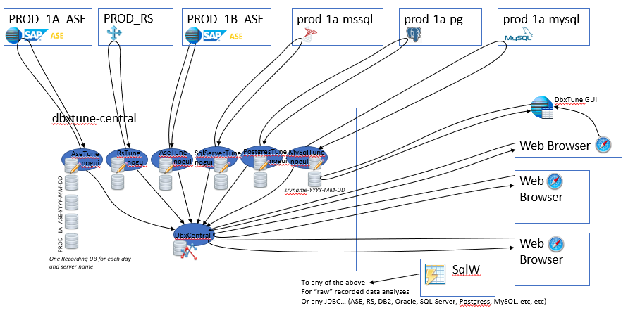

# DbxTune

It's all about: Whats happening **inside** the DBMS... 
- What SQL statements are currently beeing executed in the DBMS
- How much CPU is the DBMS consuming for the moment
- What tables are the most accessed ones
- What tables do I have locking conficts on
- What is a specific _spid/user_ doing for the moment
- What is the DBMS waiting for
- And why not:
  * Send Alarms/Alerts when specific thresholds are crossed
  * Record everything and view data at a later time

This is exactly what DbxTune does for you...

Various monitoring tables are great, but it's so _hard_ too see what's _changed!_  
DbxTune work out the difference from privious sample, which make the counter data _readable!_

So: DbxTune is a collection of programs to **Tune**/Monitor various DBMS dialects.  

The project started out as AseMon, which later was renamed to AseTune.  
ASE due to the fact that the tool only could talk to Sybase/SAP Adaptive Server Enterprise   
Then I decided to extend the tool to embrace other DBMS types as well!  
Hence the recent change to DbxTune

## How the DbxTune Tools family works

There are a couple of ways you can use the DbxTune tool set
1. **GUI mode**: view what's happening in the server **right now** (simple and easy)  
   _Note_: you can set up a in memory window so you can _go back_ and view **details** from any Collector _tab_
2. **GUI mode**: Same as above. But at the same time: **record** everything that you see in the GUI to a _recording database_  
   _Note_: if you _just_ want to record an hour at night time: Simply tell it to record between 03:00 - 04:00
3. **NO GUI mode**: If you want DbxTune to **constantly** collect data and store it in a _recording database_, 
   which you can **view** when _someone_ comes and ask you: "What's happening in the system, it's much 
   _slower_ now than _a week ago_... Whats' the problem?"
4. **GUI mode**: View/replay any recording you have done previously (in GUI mode, or NO-GUI mode)  
   Instead of connecting to a live DBMS, you just connect to the recorded _offline_ database, then click on a _timeline_ to position yourself within the recording to view **all** the details that was recorded.
5. **DbxCentral**: Have a _dashboard_ on the TV so that _anybody_ can view the Performance **Trend** Graphs.  
   And also make sure to record the activity in the test/development environments so that the developers can **see** that changes they make in the system has a positive or a negative effect on CPU Usage and/or Disk IO usage!
6. **Alarm(s)**: If you now have decide to recording performance data _all the time_, you can simply add 
   _thresholds_ to various metrics, and send an alarm when they are crossed!
7. **Daily Summary Reports**: See the top consuming SQL Statements or components from each of the DbxTune Collectors (sent by mail every midnight).
   

   
## About the Author: Goran Schwarz

I was working for Sybase and SAP for 21 years (from 1994 to end-of 2015), as a consultant...  
One of my specialties was Performance & Tuning work, and Sybase didn't have any good tools for _digging_ into the various Performance Counters (and also record a session that could be investigated on later), **so I created my own tool** (AseTune) to be able to perform my duties at customer sites.

I left SAP 2015/2016, and worked as a consultant for B3 Consulting Group - https://b3.se  

I left B3 2022, and now I work as a consultant for Execute IT - https://executeit.se
So if you are looking for help... I can help you... Contact me at: goran_schwarz@hotmail.com

## Available tools

All the below tools need enhancements, please let me know what, and how you can contribute with ideas and/or code :)

| Name              | Status             | Description                                                  |
| ----------------- | ------------------ | ------------------------------------------------------------ |
| **Ase**Tune       | Excellent          | Tune Sybase/SAP Adaptive Server Enterprise                   |
| **Iq**Tune        | Good               | Tune Sybase/SAP IQ - The Column Store database               |
| **SqlServer**Tune | Good               | Tune Microsoft SQL-Server                                    |
| **Postgres**Tune  | Good               | Tune Postgres DBMS                                           |
| **MySql**Tune     | Needs Improvements | Tune MySQL DBMS (5.7 and later)                              |
| **Oracle**Tune    | Initial State      | Tune Oracle DBMS                                             |
| **DB2**Tune       | Initial State      | Tune DB2 LUW DBMS (LUW = Linux Unix Windows, mainframe is **not** supported) |
| **Rax**Tune       | Good               | Tune Sybase/SAP Replication Agent X (not a DBMS, but still possible to capture statistics) |
| **Rs**Tune        | Good               | Tune Sybase/SAP Replication Server  (not a DBMS, but still possible to capture statistics) |
| **Hana**Tune      | Needs Improvements | Tune SAP HANA - The In-Memory combined Column/Row Store database |

### Other tools
| Name            | Status | Description                                                  |
| --------------- | ------ | ------------------------------------------------------------ |
| **DbxCentral**  | Good   | A WebServer that handles centralized metrics if/when you use NO-GUI collectors (see below for more info) |
| **SQL Window**  | Good   | Simple Query tool, connect to all of the above server types and execute commands (and any JDBC compliant DBMS) |
| **Tail Window** | Good   | Tail any file, if the file is located on Unix/Linux, simply open a SSH connection for the tail. |
| **PerfDemo**    | Beta   | A tool that can be used to stress load ASE - used for demo purposes of AseTune |

## DBX Central - Short Overview
A centralized web service

The idea behind this centralized server is that we are collecting **summary** information 
from any or all collectors in a central database, from there we can view **trend-graphs** via a web browser.

The central database will contain **less** information than the individual offline databases, where the collectors saved the data.  
Therefor _overview_ information can be saved for a longer time period...
In other words: the central database only holds data for trend graphs, while the individual collector databases contains **all** sampled details, and therefor are much bigger.

The central web server also _pushes_ out chart/graph data to web browsers, which makes
it possible to have a _live_ _dashboard_ (without having to refresh the browser all the time).  
If you are not _happy_ with the _dashboard_ and you want to create your own _layout_.  
You can for example use **Grafana** or some other tool to display the metrics data stored in the central database.

If we need to view any **details** from a recording. Then we just start the native DbxTune
application and connect to the _offline_ database.
So the central server is _just_ to view trends of how the system is working. 

For setup/installation: `README_dbxcentral_install.txt`  
For a big picture look at the file: `doc/dbxtune-central.pptx`

If you want a _preview_ how the DbxCentral looks like, you can check out http://gorans.org:8080 which is my test environment! You wont be able to see any traffic here, the DBMS instances are just idling, but hopefully you get the idea of how your system will look like...  
_Note:_ Please be gentle with the system :) 

## Overview

Here is a picture that tries to describe how Collectors, DbxCentral & Recording Databases fits together...

In the above example/picture (every *square box* is a virtual or physical machine)
- On top you have 6 different machines, running different DBMS Vendors, which runs *un touched* (no DbxTune software is installed)
- In Center; the whole DbxTune infrastructure is running on a Virtual Machine (for simplicity of upgrades and managability, which also makes it easy to remove the whole DbxTune infrastructure if you need or want to)
  - The DbxCentral Server is at the bottom of the image; With one database to store **trend graphs** for X days (12 months be default)
  - And 6 different DbxTune Collectors, which stores **Detailed Recordings**... One recording database for each day (makes it simple to *purge* old recordings when we need space for never ones)
  - Each of the DbxTune Collectors also sends **trend graph** information (in JSON format) to DbxCentral (which is stored for a longer time than the above detailed recodings)
  - The following can also be enabled:
    - Any of the DbxTune Collectors may send Alarms via (email, SMS, Slack or REST interface to *unknown*)
    - Daily Summary Reports can also be enabled, so you can see the **top** consuming SQL Statements or components from each of the collectors.
- On the Right hand side, you have:
  - WEB Browsers connecting to DbxCentral to view various trend graph information, or checking **active alarms**
  - DbxTune Native GUI Clients (running on your local machine: Windows, Mac or Linux), which can:
    - Connect to older recordings stored on the DbxCentral host; to view **detailes** of any recording
	- Or Connect to any DBMS system (on the top) to monitor *live* data (just as you have done previously without the DbxCentral and NO-GUI Collectors)

## Some comments from Sourceforge

- I just downloaded it and started randomly pointing and clicking, but the ease of use and the amount of data that is available is really impressive. 
- This new version is a great piece of work. Thank you! Mr. Schwarz. I was immediately able to see poorly-performing queries on our production box and figure out what indices needed to be added, including creating covering indices. If you administer ASE, you **need** this. Period.
- After using Sybase ASE for a quarter century and writing a million dumb scripts to try and sus out perf data, AseTune is revolutionary. I am in awe of what you've done here, and I hope I can convince my employer they ought to contribute.
- Excellent tool; good alternative to Asemon as no intermediate server is required and can also be used in batch mode. Thanks for this good work
- works perfectly.

for more details see: https://sourceforge.net/projects/asetune/reviews

## Requirements
* Java 8 and above

## How to Install
Well there is not really an installer, just follow these simple steps
- unpack the ZIP in some directory 
- start any of the tools (files are located in the 'bin' directory)
  * windows: start the BAT file (xxxTune.bat)
  * Linux/Unix/Mac: start the SH file (xxxTune.sh)  
    Note: first have to change the shell scripts to be executable: `chmod 755 bin/*.sh`
- Connect to any server you want to tune/monitor

If you want to setup DbxCentral - The central Web Console to view Trend graphs  
See: `README_dbxcentral_install.txt`

## License
- GPL v3 (see `doc/COPYING` or `LICENSE.txt`)
- For commercial licenses, contact me, at: goran_schwarz@hotmail.com

## Tool Details and Status

------------------------------------------------------------------------------
### AseTune
This is the most complete tool. This because it has been around for 10-15 years

------------------------------------------------------------------------------
### RaxTune
Get values from ra_statistics and produce X number of graphs  
This tool was new in release 2015-06-01

------------------------------------------------------------------------------
### RsTune
Get values from various admin who, xxx  
Get values from admin statistics, which all tabs under "counters" are based on  
This tool was new in release 2015-06-01  
Status: Good

------------------------------------------------------------------------------
### IqTune
This tool was new in release 2015-06-01  
Status: Good

------------------------------------------------------------------------------
### HanaTune
This tool was new in release 2015-06-01  
Status: Not that much functionality, needs **A LOT MORE** work...  
Tip: Create 'User Defined Counters' where you can add your own SQL and Performance Counters...

------------------------------------------------------------------------------
### SqlServerTune
This tool was new in release 2015-06-01  
Status: Good  
Tip: Create 'User Defined Counters' where you can add your own SQL and Performance Counters...

------------------------------------------------------------------------------
### OracleTune
This tool was new in release 2015-06-01  
Status: Not that much functionality, needs **A LOT MORE** work...  
Tip: Create 'User Defined Counters' where you can add your own SQL and Performance Counters...

------------------------------------------------------------------------------
### PostgresTune
This tool was new in release 2016-11-06  
Status: Good  
Tip: Create 'User Defined Counters' where you can add your own SQL and Performance Counters...

------------------------------------------------------------------------------
### MySqlTune
This tool was new in release 2018-11-05  
Status: Not that much functionality, needs MORE work...  
Tip: Create 'User Defined Counters' where you can add your own SQL and Performance Counters...

------------------------------------------------------------------------------
### DB2Tune
This tool was new in release 2018-11-05  
Status: Not that much functionality, needs **A LOT MORE** work...  
Tip: Create 'User Defined Counters' where you can add your own SQL and Performance Counters...

------------------------------------------------------------------------------
### SQL Window
This tool has also been around for a long time, and it has grown to be more and more potent.

Here are some of the functionality
- Code completion Ctrl+space 
- Command history
- Execute favorite commands (added by the user)
- A bunch of predefined _SQL Shortcut commands_
- Tail the Server error log (done via SSH if it's not located on your box)
- View Server configurations (show all, or just the changed ones)
- View JDBC MetaData structures
- Etc, etc...
  
------------------------------------------------------------------------------
### Tail Window
Tail any file, if it's a remote file it uses SSH to do the "remote" tail.  
It has a remote "file view" to select files on the remote server

------------------------------------------------------------------------------
### PerfDemo
Small utility to execute load in a ASE  
This utility is mainly used by me when doing demos of AseTune...  
If you want to use it, you need to install some server side objects.  

- Unzip `lib/asetune.jar` and go to directory `src/com/asetune/perftest/sql`
- Look at the `README.txt` in above directory
- if you have problems, please send me an email at: goran_schwarz@hotmail.com

------------------------------------------------------------------------------

